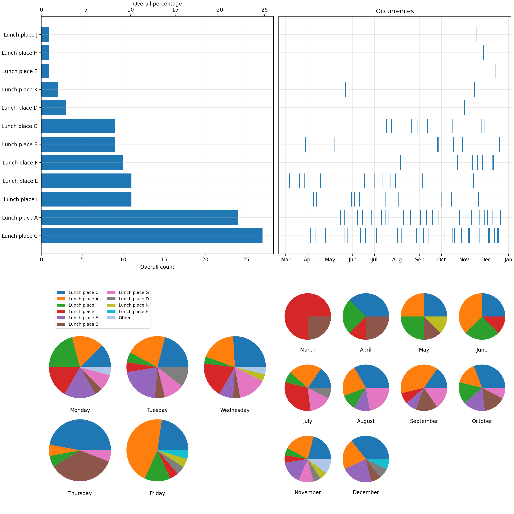

# epassi-lunch-statistics

Hasty script for visualizing lunch place statistics based on Epassi data export.

### Installation & usage

1. Login to [https://www.epassi.fi](https://www.epassi.fi) and export your usage statistics CSV.
2. Clone this repository.
3. Install [Uv](https://docs.astral.sh/uv/) Python project manager.
4. Run `uv run epassi_lunch_statistics.py <input-csv-path> <output-figure-path>`.

### Example output figure

